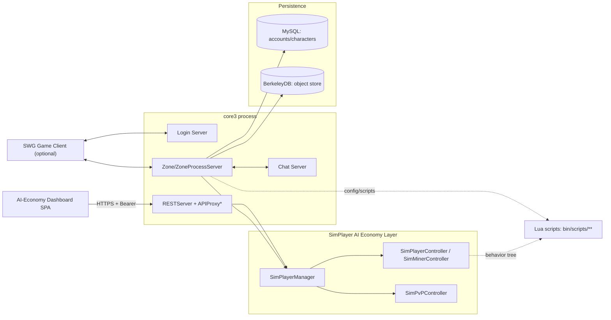

# SWGSolo (Core3) Architecture Documentation

## 1. How to Read This Document

This document describes the architecture of **SWGSolo**, a heavily-modified fork
of **Core3** — the C++ server emulator for *Star Wars Galaxies* (Pre-CU era),
maintained upstream by the SWGEmu project. It is written for a future
AI-assisted development session (this project's primary collaborator is an
LLM coding agent, not a team) picking up work on the fork without prior
context. Read this before planning or implementing any change
(`TRIP-1-plan` / `TRIP-2-implement` require it).

Sections 2-7 are universal background on the engine as inherited from
upstream SWGEmu. Sections 8+ cover architecture specific to this fork's
active work: the **AI Economy simulation layer** (SimMiner NPCs, resource
gathering, cross-planet dispatch) and the **AI PvP / Jedi archetype layer**
(NPC squads, Force Rank System). These are the areas most likely to be
touched by new plans — read them closely.

## 2. Overview

Core3 is the server-side implementation of a 2003-era MMORPG: a persistent
zoned game world (planets/cities), thousands of scripted NPCs, a full
crafting/resource economy, combat, and a Lua-scripted quest/event layer,
talking to a legacy SWG game client over a custom binary protocol. This fork
(`TrigsC/SWGSolo`, tracking `swgemu/Core3` as `upstream`) repurposes that
engine as a **single-player-capable, AI-driven economy sandbox**: hundreds of
autonomous NPCs ("SimPlayers") are meant to gather resources, craft, fight,
and progress Force ranks with no human players online, so the world stays
"alive" unattended. All of that new behavior is currently
**simulation-only** — no real inventory/credit/market mutation — until the
owner explicitly approves an economy-mutating phase.

## 3. Technology Stack

- **Language**: C++14 (server core), Lua 5.x (game logic/config/scripting), a
  small amount of Go (`idlc-go`, a from-scratch reimplementation of the IDL
  compiler).
- **Build system**: CMake 3.7+ + Ninja, Clang ≥16 (preferred) or GCC ≥5.4,
  `ccache`. 64-bit only.
- **Persistence**: MySQL/MariaDB (`libmariadb-dev`) for accounts/characters;
  a custom on-disk Berkeley DB (`libdb5.3`) object store (`db3`) for
  distributed-object persistence; plus a local `navmesh.db`.
- **Networking**: Custom binary SWG protocol (login/zone/ping/chat servers)
  over UDP/TCP; `libcpprest` (C++ REST SDK) powers a small internal HTTPS
  REST API (`RESTServer`) for the AI-economy dashboard, gated by Bearer
  token, listening on TCP 44443.
- **Testing**: GoogleTest/GoogleMock (vendored,
  `MMOCoreORB/utils/googletest-release-1.13.0`), compiled directly into the
  server binary (see §12).
- **Containerization**: Docker (Debian bookworm image) is the sole supported
  dev/build/run environment; see §6.
- **Frontend (dashboard only)**: a small static 3-file SPA (HTML/CSS/vanilla
  JS) served from `MMOCoreORB/bin/web/aieconomy-dashboard/`, no framework, no
  build step.

## 4. Project Structure

```
workspace/Core3/                          # git repo root (branch: miner-ai; remotes: origin=TrigsC/SWGSolo, upstream=swgemu/Core3)
├── docs/                                 # design docs + (new) TRIP docs
├── docker/                               # Dockerfile, compose, build.sh/run.sh — the dev environment
├── linux/, wsl2/                         # native (non-docker) bootstrap scripts, largely unused for this fork
└── MMOCoreORB/                           # the actual server source tree
    ├── CMakeLists.txt                    # top-level build config
    ├── src/
    │   ├── main.cpp, CoreProcess.h       # process entry point
    │   ├── server/
    │   │   ├── zone/                     # THE GAME — see §8
    │   │   │   ├── objects/              # every in-game entity type (creature, player, tangible, ship, resource...)
    │   │   │   ├── managers/             # ~45 singleton subsystem managers (combat, crafting, jedi, aieconomy, ...)
    │   │   │   └── ZoneServer / ZoneProcessServer / Zone.idl
    │   │   ├── login/, ping/, status/, chat/   # the other network-facing servers
    │   │   ├── web/                      # RESTServer + APIProxy* — the dashboard's backend, see §11
    │   │   ├── db/                       # MySqlDatabase / MantisDatabase (BDB object store)
    │   │   └── metrics/
    │   ├── templates/                    # static game-data schema (.iff-derived): creature/tangible/resource/crafting/... templates
    │   ├── terrain/, pathfinding/        # heightmap/procedural terrain + Recast navmesh pathfinding
    │   ├── tre3/, client/                # client-facing asset/protocol glue
    │   ├── autogen/                      # GENERATED from .idl files — do not hand-edit
    │   └── tests/                        # GoogleTest sources, one binary (core3tests) linked into core3
    ├── utils/
    │   ├── engine3/                      # git submodule — the base engine (ORB, Lua bindings, Locker/Reference, net, containers)
    │   └── googletest-release-1.13.0/
    ├── bin/                              # the RUNTIME tree (also where the built `core3` binary lands)
    │   ├── conf/                         # config-local.lua, config.lua, adminusers.lst, ssl certs
    │   ├── scripts/                      # ALL LUA — managers/, ai/, screenplays/, commands/, object/, mobile/, skills/...
    │   ├── web/aieconomy-dashboard/      # dashboard SPA (index.html/app.js/styles.css)
    │   ├── databases/, navmeshes/, log/
    └── sql/                              # schema migrations
idlc-go/                                  # separate Go module: from-scratch IDL compiler reimplementation
```

## 5. Core Architecture Principles

- **IDL-generated distributed objects.** Nearly every persistent/networked
  game entity (`ChatMessage`, `Zone`, `CreatureObject`, ...) is declared once
  in a `.idl` file (Java-like syntax) and code-generated into matching
  `*Implementation`, stub, and adapter C++ classes under `src/autogen/`. Hand
  edits go in the `.idl` file or an `*Implementation.cpp` companion, never in
  generated output. See §9.
- **Reference-counted, lock-guarded objects.** Object lifetime is managed via
  `Reference<T>` / `ManagedReference<T>` smart pointers from engine3, and
  concurrent access to distributed objects is guarded by an explicit
  `Locker`/mutex discipline baked into the generated code. **This project's
  #1 stability rule (owner-stated): match existing lock choreography exactly
  — a mismatched lock/mount sequence has produced real regressions (the
  P.4.4 vehicle-mount orphan bug) and is the single fastest way to crash or
  corrupt live server state.**
- **Manager-per-subsystem.** Game systems are singletons under
  `server/zone/managers/*` (`CombatManager`, `CraftingManager`,
  `ResourceManager`, `JediManager`, `AiEconomyManager`, ...), each owning its
  slice of state and typically exposing both C++ and Lua-callable surfaces.
- **C++ core, Lua-scripted behavior/config.** Anything that changes
  frequently — NPC behavior trees, quest/event "screenplays", command
  definitions, tunable config (spawn rates, AI economy knobs) — lives in Lua
  under `bin/scripts/`, loaded at runtime, not compiled. C++ is reserved for
  performance-sensitive or structurally-fixed logic. New tunables should
  default to a Lua config table, not a compiled constant.
  See §10.
- **Docker-only, incrementally-built dev loop.** There is no local (non-container)
  build path in active use for this fork. See §6.

## 6. Build System & Toolchain

All development happens inside the `swgemu_server` Docker container (Debian
bookworm, Clang≥16/LLD toolchain, CMake+Ninja, ccache). The host mount that
would expose the container's source tree at
`/srv/games/swgemu-core3/workspace` is **known to be unreliable** — do not
assume it is live; verify with a real `ls`/`cat` before relying on it, and
fall back to `docker cp` in/out of the container plus `chown 44400:44400`
after any out-of-container edit (this UID:GID is what the in-container
`swgemu` user maps to).

```bash
# Build (incremental; run from anywhere inside the container, cd's to the repo itself)
docker exec -u swgemu -e TERM=xterm swgemu_server bash -lc 'build'
#   TERM=xterm is REQUIRED — the script calls `clear` and dies without a TTY term.
#   `build clean`   -> full rebuild (make clean-ninja-debug first)
#   `build nocache` -> clears ccache first
#   `build asan`    -> RelWithDebInfo + AddressSanitizer

# Run / restart the live server (~40-50s startup)
/home/swgemu/bin/run
#   RESTARTING THE LIVE SERVER IS THE OWNER'S CALL, not the agent's. Explicit
#   /TRIP-verify invocation authorizes disconnecting test players and a guarded
#   automatic restart after a green build. It tries normal GDB shutdown first,
#   then may force-kill only the exact core3 process; all other work hands off.
```

Key CMake options (top-level `MMOCoreORB/CMakeLists.txt`): `BUILD_IDL` (runs
the IDL compiler as part of the build), `COMPILE_TESTS` (builds
GoogleTest/Mock into the binary), `ENABLE_ASAN`/`ENABLE_TSAN`/`ENABLE_UBSAN`.
Debug builds always pass `-Werror`-equivalent strictness — **build clean with
no new warnings before handing work back** (owner-stated standard).

## 7. Configuration

- **`MMOCoreORB/bin/conf/config-local.lua`** — the primary local/runtime
  config (DB credentials, ports, feature toggles); overrides
  `config.lua`. Not checked in with secrets.
- **`MMOCoreORB/bin/scripts/managers/*.lua`** — per-manager tunable config
  (e.g. `sim_player_manager.lua` holds all AI-economy knobs: demand
  thresholds, station-travel gates, vehicle-mechanics toggle, recovery dry-run
  flag, `ticketCollectorTravel` interplanetary-travel gate +
  `interiorContainmentMarginMeters`, and the `cellNavDiag` toggles —
  `enabled` for the diagnostic test-bot spawn and `logging` as the master gate
  for all `bin/log/cellnav.log` output, both default off). F_0.8.0/F_0.8.1 add the
  `structureTraversal` block — `enabled`/`logging`, `hollowEscalation*`,
  `farSideEgress`, `hollowDoorEgress.*`, the `zeroClip.*` probe and enforcement
  knobs (`enforce`, `rejectionCap`, `walkableConfirm`,
  `walkableToleranceRatio`), and the `structureTraversalTest` scenario matrix —
  all default off. This is the primary place new simulation features expose
  owner-tunable, default-off gates.
- **`MMOCoreORB/bin/conf/features.lua`** — global feature flags.
- Compiled-in constants are the exception, not the default — prefer a Lua
  config entry so behavior is tunable without a rebuild.

---

## 8. Game World / Server Architecture

- **Process model**: one `core3` binary hosts the zone server(s); separate
  lightweight servers handle login, ping, status, and chat (all under
  `src/server/`). `main.cpp`/`CoreProcess` wires them up at boot.
- **Zones** (`server/zone/Zone.idl`, `GroundZone`, `SpaceZone`) are the
  per-planet/per-instance simulation containers; `ZoneProcessServer` drives
  their tick loop.
- **Game objects** (`server/zone/objects/*`) form a template-driven class
  hierarchy: `SceneObject` → `TangibleObject`/`IntangibleObject` →
  `CreatureObject` → `AiAgent` (NPCs) / `Player` (human clients) /
  `SimPlayer` (this fork's autonomous NPC economy actors, see §9). Static
  game data (stats, appearance, loot tables) is loaded from `templates/`
  (originally derived from client `.iff`/datatable files) rather than
  hard-coded.
- **Pathfinding/terrain**: `terrain/` (heightmap, water level, resource
  layers) + `pathfinding/recast` (Recast/Detour navmesh). Critically for this
  fork's AI work: **only cities/POIs are navmeshed** — open wilderness
  (where resources spawn) has no navmesh, so `findPath` degrades to a
  2-node "direct fallback" there. This is the root architectural constraint
  behind the overland-reachability and station-travel work in §9.
- **Persistence**: two-tier — MySQL for account/character rows, and a
  Berkeley DB-backed distributed object store (`server/db`) for the
  full object graph, keyed by ORB object IDs.

## 9. Distributed Object / IDL Codegen System

The engine's most distinctive pattern, and the one most likely to trip up an
unfamiliar change:

1. Author a `.idl` file (Java-like DSL, see any `server/**/*.idl`) declaring
   fields, methods, and annotations (`@json`, `@read`, `@dirty`, etc.) for a
   distributed object.
2. The IDL compiler (`BUILD_IDL` CMake step; being reimplemented in Go under
   `idlc-go/`) generates matching C++ under `src/autogen/`: an interface, an
   `*Implementation` skeleton (hand-filled in a co-located
   `*Implementation.cpp`), network stub/adapter classes for RMI, and
   GoogleMock test doubles.
3. Objects are always held via `Reference<T>`/`ManagedReference<T>`, never
   raw pointers/values, and mutation requires taking the object's `Locker`
   first — the generated code enforces this pattern; **new code should mimic
   the locking sequence of the nearest existing caller rather than invent
   one.**
4. **Never hand-edit files under `src/autogen/`** — edit the `.idl` or the
   `*Implementation.cpp`/`.h` and rebuild.

## 10. Lua Scripting Layer

- Bound into C++ via engine3's `engine/lua/*` (a Lua↔C++ bridge:
  `LuaObject`, `LuaFunction`, exception translation).
- **`bin/scripts/managers/`** — one Lua file per manager, holding config and
  manager-level callbacks.
- **`bin/scripts/ai/`** — NPC behavior trees (e.g. `simMiner.lua`, a
  deliberately no-op tree that cedes movement entirely to this fork's C++
  `SimPlayerController`, avoiding a dual-driver conflict with the default
  `GeneratePatrol` wander behavior). `simHunter.lua`/`simPvp.lua` override **only**
  the IDLE slot, so the root falls back to `rootDefault` and the combat
  attack/target sockets stay live — the C++ controller drives movement while the
  stock tree drives combat (the controller must call `activateAiBehavior(true)`
  on engage to wake that tree promptly).
- **`bin/scripts/screenplays/`** — quest/event/world-state scripts (themepark,
  villages, spawners, custom one-offs like `market_seeder.lua`).
- **`bin/scripts/commands/`, `object/`, `mobile/`, `skills/`** — command
  definitions, per-object-type Lua overrides, mobile (NPC) templates, skill
  definitions.
- Convention: Lua is the default location for anything tunable or
  frequently-iterated; C++ is for structural/performance-critical logic
  only.
- **Safe Lua↔C++ object wrapping (crash class).** A Lua wrapper constructor
  like `AiAgent(pObj)` / `LuaAiAgent(pObj)` `dynamic_cast`s the underlying
  scene object; in a debug build (`DYNAMIC_CAST_LUAOBJECTS`) wrapping an object
  that is not that concrete type fires `E3_ASSERT` in `*::_setObject` →
  `abort()`, which **`pcall`/`safeCall` cannot catch** (it is a process signal,
  not a Lua error); a release build produces a mis-typed pointer (UB). Never
  wrap a possibly-wrong-type object — always gate first with a safe virtual
  predicate that takes no cast: `SceneObject(pObj):isCreatureObject()` /
  `:isAiAgent()`. Type-specific reads that live only on `LuaAiAgent` should be
  mirrored onto `LuaCreatureObject` using the native safe cast
  `CreatureObject::asAiAgent()` (returns `nullptr` for non-agents) so callers
  never need the `AiAgent()` wrap — e.g. `LuaCreatureObject::isSimPlayerBot`
  (F_0.7.2), which fixed a SIGABRT when a real player's spatial chat reached a
  buffer NPC's `isSimPlayerBot` gate.

## 11. Web/REST Layer (AI-Economy Dashboard)

- **`src/server/web/RESTServer.{h,cpp}`** hosts a small HTTPS API
  (`libcpprest`), Bearer-token gated, on port 44443.
- **`APIProxy*Manager` classes** (`APIProxyAiEconomyManager`,
  `APIProxyPlayerManager`, `APIProxyGuildManager`,
  `APIProxyStatisticsManager`, `APIProxyConfigManager`,
  `APIProxyChatManager`, `APIProxyObjectManager`) are thin per-manager
  read-mostly facades — the pattern to follow for exposing any new manager's
  state to the dashboard.
- **`SimPlayerManager::getDashboardJson()`-style methods** (in the ~19k-line
  `SimPlayerManager.cpp`) assemble the actual JSON payload sections
  (`minerActivity`, `coveragePlanner`, `minerRecovery`,
  `pathValidationDiagnostics`, `simulatedAcquisition`, `vehicleMechanics`,
  `stationTravel`, `pveActivity`, ...) consumed by the dashboard frontend. The
  SPA is hash-routed (`#/command`, `#/warfront`, `#/wilds` for live PvE hunter
  positions, ...).
- **Frontend**: `bin/web/aieconomy-dashboard/` — static `index.html` +
  `app.js` + `styles.css`, no build step, deployed by copying files
  in-place (instant, no server restart needed for frontend-only changes).
- Ground truth for any AI-economy behavior claim is this live endpoint, not
  code inspection alone:
  ```
  curl -sk https://127.0.0.1:44443/v1/aieconomy/dashboard/ \
    -H "Authorization: Bearer <token>"
  ```

## 12. AI Economy Simulation Layer (SimPlayers) — active development focus

This is this fork's primary custom subsystem, layered on top of the stock
`AiAgent`/`CreatureObject` hierarchy:

- **`server/zone/objects/creature/simplayer/SimPlayerManager.{h,cpp}`** —
  the "economy brain": tracks all SimPlayer NPCs, drives demand/supply
  simulation, resource targeting, cross-planet coverage planning, and
  assembles all dashboard JSON (§11). The single largest and most
  frequently-touched file in the fork.
- **`SimPlayerController.{h,cpp}`** — per-NPC controller (`SimMinerController`
  for resource gatherers): movement/pathing lifecycle, sample/gather
  lifecycle, stuck-watchdog re-pathing, activation trust-tier gating
  (`isActivationTrustAcceptable()` — accepts `verifiedPath` or the
  overland-reachable `directOverland` tier). Since P.6.5b the movement
  pipeline is **cell-aware**: `moveTo` accepts an optional target cell
  (world position for distance math + cell-local position for the path
  request), and path-node cells survive into `PatrolPoint`s — outdoor
  callers (all miners) are unaffected. Caution: the engine's
  `findNextPosition` math assumes one coordinate space per comparison; any
  new in-cell movement must keep world/cell-local forms separate (P.6.5b
  design doc §13.1 lesson; reinforced by the F_0.4.8–F_0.4.11 cell-nav work
  and `tuto_0.4.11.md`). The cell-navigation stack (F_0.4.7–F_0.4.11,
  `docs/ai-cell-navigation-design.md`) adds: POB **cell entry** (adopt the
  cell on `findNextPosition`'s duplicate-skip branch — no teleport-into-wall
  at a portal), a **cell-egress** leg (`SimPlayerController::beginCellEgressIfNeeded`
  — portal-follow `findPath` to a computed building exterior, then resume the
  original move), **nearest-exterior-portal** selection (native
  `BuildingObject::getNearestExteriorPortalPoint`, for multi-door starports),
  and gated **ticket-collector interplanetary travel** (`ticketCollectorTravel`,
  default off): a bot walks through the starport interior to the collector in
  the enclosed hollow and out of the destination hollow after boarding, with a
  tri-state interior resolver (`resolveStarportInteriorWaypoint`, whose
  containment test allows a bounded horizontal margin so an enclosed-hollow
  collector baked outside the collision AABB still associates with its
  starport), bounded retries, safe outdoor recovery, and an idempotent PvP
  arrival OID barrier. Two `findNextPosition` direction-calc fixes (hold facing
  on a ~zero step; wrap a negative angle by `+2*PI` not `+PI`) removed a
  pivot-swivel. Cell-nav instrumentation (`CellNavDiagLog` → `bin/log/cellnav.log`)
  is retained but gated by `cellNavDiag.logging` (default off).
- **Structure traversal (P.9 / F_0.8.0)** — POB enter/exit is no longer an
  ad-hoc `moveTo` sequence but an explicit state machine on
  `SimPlayerController`: `StructureTraversalPhase`
  (`Idle→ApproachDoor→InteriorRoute→Egress→Reentry→CombatPaused→Resuming`)
  plus a `traversalGeneration` **separate from** the movement work-loop
  generation, so combat can cancel a path task without cancelling the
  traversal intent. Bounded **hollow escalation** recovers a bot stranded in a
  starport's enclosed hollow. **D2b far-side egress** fixes the dominant
  failure: from inside a starport the pathfinder answers "reach the far
  exterior door" with a valid route out the *nearest* portal, back into the
  hollow — a path that **succeeds while making no progress**, which the repair
  ladder never sees because that ladder only runs on path *failure*.
  `acceptFoundPath` rejects such a route and retargets to the nearest reachable
  non-hollow exit **cell**. Its predicate deliberately exempts a destination
  that is itself in the hollow: multi-hop planet transit lands a bot on the pad
  (ticket collector) and must not be marched out the far side — see
  `docs/ai-cell-navigation-design.md` and the `F_0.8.0-D*` proposals.
  A **26-scenario live matrix** (`structureTraversalTest` in
  `sim_player_manager.lua`, AI template `bin/scripts/ai/simTraversalTest.lua`)
  is this subsystem's verification vehicle in place of unit tests, which cannot
  reach code that needs a live zone's navmesh/PortalLayout. Its runner is a
  single-writer state machine: ownership of the scenario cursor is held under
  `structureTraversalTestMutex` for a whole invocation while task scheduling
  happens **outside** the lock, because the controller notify hooks take that
  same mutex from threads that may already hold an agent lock (harnessMutex →
  agentLock against agentLock → harnessMutex is an ABBA deadlock).
  Instrumentation: `StructureTraversalDiagLog` → `bin/log/structuretraversal.log`,
  gated by `structureTraversal.logging`.
- **Traversal adoption by production controllers (F_0.8.1)** — F_0.8.0 built the
  state machine but nothing used it: `enterStructure()` had **exactly one caller,
  the test harness**. Adoption is therefore a distinct architectural step from
  the machinery, and the rule for any future controller is that a cell-bearing
  destination is a **building entry** and belongs to `enterStructure`, not a bare
  `moveTo`. Migrated: `SimHunterController` (buff providers) and
  `SimPvPController` (collector approaches, starport interior waypoints).
  Migration sites are guarded on a non-null cell — a starport hollow resolves to
  a null cell and must stay an outdoor approach, since the hollow is frequently
  the destination. Where the legacy call was `moveTo` rather than
  `moveToInterior` the guard must **also** test the feature gate, because
  `enterStructure`'s null-cell fallthrough calls `moveToInterior`; without that,
  gate-off behaviour changes. **Miners are deliberately not migrated** — station
  travel teleports them to an *outdoor* arrival by design, so they have no reason
  to enter a cell. `acceptFoundPath` is now a non-virtual **template method**
  (invariants + `virtual acceptFoundPathHook`): a subclass that overrode it
  wholesale silently opted out of every base invariant, and that is now a compile
  error. **`exitStructure` is NOT yet adopted** — production bots enter through
  the state machine and leave through the legacy cell-egress ladder; see
  `docs/1-plans/F_0.8.2_traversal-egress-adoption.plan.md`.
- **Test-oracle vs. production telemetry (F_0.8.1)** — an architectural boundary
  the harness originally got wrong. `SimPlayerManager`'s
  `structureTraversal{Teleport,ZSanity}` counters are **global dashboard
  aggregates**; the matrix must assert on **per-agent** tallies held on
  `SimPlayerController` (monotonic, deliberately not reset by
  `clearStructureTraversalState`, `std::atomic` because the oracle reads them
  off-thread). Asserting on the globals lets any bot in the world fail an
  unrelated harness scenario — latent and invisible until a production bot first
  ran traversal. Counters belonging to a body destroyed mid-scenario are folded
  into a per-slot carry inside `destroyStructureTraversalTestBot`, the single
  choke point every destroy path passes through, **under the agent lock** so the
  snapshot is final against the writer.
- **Post-lock lifecycle recheck (F_0.8.1)** — `SimPlayerController::checkArrival`
  guards on `agent->getZone()` *before* acquiring `Locker locker(agent)`, so a
  task can pass the guard, block on the lock, and resume after another thread has
  torn the agent down under that same lock (harness destruction and recovery
  despawn both call `destroyObjectFromWorld` there). It now rechecks the same
  predicate immediately after acquisition and returns without rescheduling. The
  general rule: any pre-lock lifecycle guard in this controller needs a matching
  post-lock recheck, or the work runs on a world-destroyed agent.
- **Zero-clip movement (D7)** — an anti-clipping invariant for bot paths,
  shipping **observe + enforce, both default-off**. The probe
  (`SimPlayerController::probeEmittedPathClearance`) runs on the **pathfinding
  worker thread**, before path delivery, so it never adds tick latency; results
  are explicit (`clear`/`would_block`/`skipped`/`truncated`/`error`) and
  aggregated worst-evidence-first so an inconclusive probe can never read as
  clear. Enforcement refuses a conclusively obstructed route and re-asks,
  bounded by `zeroClip.rejectionCap`, walking the route on exhaustion rather
  than stranding the bot. It fails **open** on inconclusive probes — the
  deliberate opposite of the harness exit assertion, which fails closed: a test
  oracle that cannot see must not pass the subject, but a mover that cannot see
  must still move. Two architectural facts came out of this work: the world-query
  snapshot must be `SortedVector<ManagedReference<TreeEntry*> >`, never the raw
  `InRangeObjectsVector`, because the probe walks it off-thread after the zone
  lock is released; and the appearance ray tests the straight **chord** between
  two path nodes, which for a staircase or bridge deck passes through the solid
  mass beneath the walkable surface — `zeroClip.walkableConfirm` confirms a
  flagged chord against the navmesh (the authority on what an agent can stand
  on) and overruled ~half of all raw hits. `PathFinderManager::getRecastPath`'s
  `float& len` is **not** a path length (it sums `x²+z²` of absolute
  coordinates and is only ever a relative comparator); measure real lengths from
  the returned points.
- **`SimPvPController.{h,cpp}`** — the PvP/combat-oriented sibling
  controller for AI squads (see §13).
- **`SimHunterController.{h,cpp}`** — the PvE hunter controller (P.8). Drives a
  market-driven mission-board hunt loop (shared travel → terminal → held offer →
  real lair spawn → pull → kill → simulated harvest) that closes the
  crafter→hunter demand loop via the acquisition/demand ledger. It also owns the
  gated cross-planet buff-trip phase while `SimPlayerManager` owns offer,
  dispatch, and route state. Combat is **real** (`CombatManager::startCombat`
  with an AI-aligned rifle; wild creatures retaliate) but loot stays simulated.
  Neutral hunters use player-safe targeting and defender-driven re-engagement so
  they reject real players and follow the actual creature attacking them (the
  player-side guard mirrors `AiAgentImplementation::isAttackableBy` and is consulted
  by both `CombatManager::startCombat` and `getAreaTargets`, so it also stops AoE
  splash onto players). The controller's two tick loops — `onTick` (arrival cadence)
  and `runActiveTick` (`SimHunterActiveTickTask`) — run on independent task-pool
  threads, so combat-target state (`targetOid`/observer) follows a single-writer rule:
  `runActiveTick` owns it (HUNTING-scoped), while `onTick` only self-defends via the
  interceptor path on travel legs and never writes it. Defender-list reads snapshot
  under the hunter lock (`add`/`removeDefender` are `@preLocked`).
  F_0.5.0 hardened the terminal mission-board handoff against those two threads: a
  monotonic **terminal-visit epoch** (`SimPlayerManager::openTerminalVisit` /
  `pveTerminalVisitEpoch`) is captured when a hunter opens a board and re-checked at
  commit, so `generatePveBotMissionOffers` discards any offer set that finishes after
  the order concluded or the body was drained; `activeTickGeneration` is an
  `std::atomic<uint64>` (latest-wins) and `tickRunning` a non-blocking single-flight
  guard so no two `runActiveTick` bodies run concurrently. An empty board no longer
  abandons the trip — the hunter dwells and re-generates for a bounded
  `offerMaxAttempts`×`offerRetrySeconds` budget.
  Hunt dispatch is gated on **demand pressure per family**: the market matchmaker
  only issues an order when a family's `signalUnits > 0`, i.e. accumulated supply is
  below its `effectiveCeiling` (`familyAllocationCeiling{Units,Fraction}` in the
  acquisition ledger). The fraction is an anti-domination cap for *multi-family*
  profiles, set to `1.0` per family so each can fill its profile's true
  `desiredReserve` — a lower cap silently strands the whole roster once supply
  crosses it (F_0.5.0 saturation fix). As of **F_0.6.0** hunters supply **three
  creature families** — `hide`, `bone`, and `meat` — not meat alone: each kill
  credits all three via a single target-lock in `recordPveHunterHarvest`
  (per-family deposit gated at `harvestAmount >= 3`), demand for hide/bone is
  recognized by extending existing profiles in `demandStateProfileUsesConceptualLabel`
  (`composite_armor_supply`→`hide*`, `master_weaponsmith_staples`→`bone*`), and a
  hunt reserves the expected units of **all three** families on accept
  (`computeReservedInboundByProfileFamily` iterates enabled profiles × 3 families;
  both matchmaker paths run a shared intra-pass multi-family signal decrement so a
  single pass never over-dispatches a family). Effect: meat saturation alone can no
  longer idle the whole roster — pressure spreads across families. This is a
  **demand-spread** slice only: `consumeReservation` still does **not** drain
  `familySupply` in-session (supply = immutable boot baseline + monotonic
  `pveSessionHarvestByFamily`), so with no family *consumer* yet each family still
  re-saturates at its reserve target. An in-session consumer that closes the drain
  loop remains the documented next economy phase (same accepted debt as meat).
  Hunter-opt-in navmesh/overland hybrid movement (`usesNavmeshHybridMovement()`,
  base false so miners/PvP are unchanged): navmesh inside cities, overland in the
  wild. Bodies spawn `PLAYER | ATTACKABLE` and force faction 0 so wildlife fights
  them while `isAttackableBy` keeps real players from attacking the neutral bot;
  they use a neutral combat mob template (`death_watch_wraith` + `rifle_t21`,
  configured in `sim_player_manager.lua`). Combat firing is woken via
  `activateAiBehavior(true)` on engage. P.8.6 adds need-gated **real buffs**
  (gated `realBuffs.enabled`, default off): the hunter walks into its home-city
  med center / cantina and obtains buffs from the owner's real Doctor/Musician/
  Dancer buffer NPCs (`PlayerManager::startWatch`/`startListen` observers; the
  doctor's chat negotiation driven via a `ScreenPlayTask` since a bot's chat
  can't reach the player-only `SPATIALCHATSENT` observer), only when a tracked
  buff is missing or within a refresh threshold. Interior cells are reached with
  a leg-scoped non-hybrid latch; a synthetic `realBuffs.fallbackBuffs` set covers
  unreachable providers. Design doc: `docs/ai-pve-playerbot-design.md`.
- **Everything here is simulation-only by explicit owner policy**: no real
  inventory/credit/market/persistence mutation happens from this layer until
  an economy-mutation phase is explicitly approved. New work here defaults
  to a dry-run/simulated code path unless the plan says otherwise.
- **Config**: `bin/scripts/managers/sim_player_manager.lua` — all tunables
  (demand thresholds, recovery dry-run flag, `enableStationTravel`,
  `enableVehicleMechanics`, coverage/dispatch gates). New behavior should be
  gated here, default-off, per the project's "reversible, gated" standard.
- **Design doc**: `docs/ai-miner-navigation-design.md` is the living plan
  for this subsystem (phases A/B, P.4.1-P.4.5+) — keep it current alongside
  code changes (see `docs/ARCHI-rules.md`).

## 13. AI PvP / Jedi Archetype Layer

A second major custom vertical, sharing the SimPlayer NPC infrastructure:

- **PvP squads**: NPC-driven group combat (`SimPvPController`), with
  "player-mimetic" routed travel — BFS-planned multi-leg journeys over the
  real fare matrix, departures from actual starport ticket collectors
  (interior where pathable), intra-planet legs via real city shuttleports,
  cantina-derived hangouts (all three per-city locations resolved from live
  game data with boot/navmesh-readiness guards), tactical arrival one city
  out from contested destinations, and break-off-after-deaths cohesion —
  design in `docs/ai-pvp-mimetic-travel-design.md` and
  `docs/ai-pvp-squad-design.md`.
- **Controller-driven combat engagement (P.6.6, F_0.7.0)**: an opt-in combat
  lane that replaces the emergent stock behavior-tree combat. `SimPvpBotController`
  scans a ~100 m radius, drives a cell-aware approach to the target (portal graph,
  no clipping through starports), and engages/holds at weapon range with LOS
  enforced by stock combat (`CombatManager::startCombat`). While engaged the
  controller swaps in a `simPvpCombat` no-op-MOVE AI map (`setCustomAiMap` +
  `setAITemplate`, formationOffset preserved) so the stock tree never double-drives
  movement; a per-tick `driveCombatMovement` owns approach→engage→hold, and
  `isInteriorTraversalActive()` suppresses combat while a member is mid-starport
  traversal (traversal wins). Two hardening fixes ship with it: a shared
  target-eligibility helper (players or enabled sim-bots only) keeps ordinary NPC
  combat on stock self-defense, and an in-range bot engages-and-holds under LOS
  loss (LOS is telemetry-only) instead of clearing combat and dying passively.
- **Squad aggro-sharing / combat contagion (P.6.6b, F_0.7.1)**: default-off,
  squad-local shared-aggro so idle squadmates converge on a teammate's fight over
  the same cell-aware lane. Each `SimPvpSquad` keeps a small TTL-refreshed
  shared-enemy set (`recordPvpSquadCombatTarget` / `getPvpSquadSharedCombatTargets`,
  guarded by `pvpSquadMutex`, agent locks taken **outside** it); an idle
  controller acquires a live shared target within a convergence-specific radius
  (300 m) and timeout (60 s), with failed-target suppression so it never thrashes
  an unreachable contact. Verified live at the squad level; per-member contribution
  telemetry is recorded debt. All P.6.6/6.6b gates (`pvpConfig.combat.*`
  `controllerDrivenEngage`, `squadAggroSharing`, `logCombatMovement`) ship
  **default-off**; dashboard surface is `pvpActivity.combatEngagement`.
- **Jedi/Force archetype**: NPC Jedi with a Force-power ladder and FRS
  (Force Rank System) progression paid via the same XP hooks real players
  use — design in `docs/ai-jedi-force-archetype-design.md` and
  `docs/ai-jedi-frs-rank-design.md`.
- Both layers follow the same conventions as §12: Lua-gated config,
  simulation/dry-run defaults, dashboard visibility, verify-on-live-server
  before declaring done.

---

## Data Flow Diagrams



## Error Handling Strategy

- Native engine exceptions (`LuaCallbackException`, `LuaPanicException`,
  ORB/RMI exceptions) are caught at manager/controller boundaries and
  logged; a scripting error in one NPC's Lua callback should not crash the
  zone process.
- `SimPlayerController`'s stuck-watchdog is the model for this fork's
  AI-layer error handling: detect a stalled/failed state (e.g. path
  failure), bound the retry, and fall back to a safe recovery path
  (`onPathFailed`, manager-level recovery/reset) rather than looping or
  crashing.
- Prefer surfacing failures into the dashboard diagnostics
  (`pathValidationDiagnostics`, `minerRecovery`) over silent logging only —
  this project's actual debugging workflow is reading the live dashboard.

## Testing Strategy

- GoogleTest/GoogleMock, compiled directly into the `core3` binary as a
  library (`core3tests`) rather than a standalone test executable; run via
  `core3 runUnitTests` (see `docs/4-unit-tests/TESTING.md`).
- Existing coverage (`src/tests/*Test.cpp`) focuses on core engine
  primitives (terrain, zones, creature objects, credit objects, Lua
  bindings, name manager) — the AI-economy/PvP/Jedi layers are presently
  verified primarily via the **live dashboard**, not unit tests. New unit
  tests are welcome but the project's actual acceptance bar for AI-layer
  work has been live-dashboard verification before/after.
- Mocking scaffolding (`MockBehavior.h`, `MockCompositeBehavior.h`,
  `DeadlockTestBase`) exists for behavior-tree and concurrency testing.

## Performance Considerations

- Hot paths (zone tick, pathfinding, object locking) are C++ by design;
  keep new frequently-executed logic out of Lua.
- `SimPlayerManager` iterates potentially hundreds of NPCs per tick for
  dashboard/economy bookkeeping — be mindful of adding O(n²) work across the
  SimPlayer population without profiling against the live server.

## Security Considerations

- The REST dashboard API is Bearer-token gated over HTTPS (self-signed cert
  in `bin/conf/ssl.*`) — do not add unauthenticated endpoints.
- `adminusers.lst`/`webusers.lst` gate in-game admin and web access
  respectively.
- Config files containing credentials (`config-local.lua`, `.my.cnf`) must
  never be committed with real secrets.

## Deployment

- Single-server, self-hosted, Docker-only. There is no CI/CD pipeline or
  staged deployment — `build` (incremental) followed by an owner-approved
  `run`/restart against the one live container **is** the deployment
  process. See §6.

## Conclusion

This fork inherits a mature, if idiosyncratic, C++ MMO server architecture
(IDL-generated distributed objects, strict lock discipline, Lua-scripted
behavior) and builds a new autonomous-NPC economy simulation on top of it
without modifying the underlying engine's contracts. The two central
constraints for any new work are architectural, not stylistic: (1) match
existing `Reference`/`Locker` choreography exactly, and (2) keep new
AI-economy/PvP/Jedi behavior gated, default-off, and simulation-only until
the owner explicitly approves a mutating phase.
