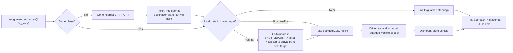
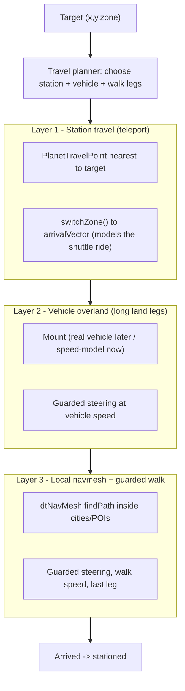

# P.4.0 AI Miner Navigation & Travel Architecture

Status: **in progress** — P.4.1–P.4.3 implemented and verified live; vehicle
speed and station travel are the next phases (see "Implementation status" below).
Specifies how AI SimPlayers move across a SWG planet — locally, overland, by
vehicle, and between stations — in a player-mimetic way. It does not change
economy mutation, extraction, inventory, vendor/market/crafting/credit, or
persistence behavior. All work stays inside the existing simulation-only safety
boundary until an explicit economy phase is approved.

Supersedes the movement assumptions in `ai-miner-p3-alignment.md` only on *how a
miner physically reaches a target*. The coverage-first North Star (stationed
share is success, movement is a means) is unchanged. Revised 2026-06-28 to
incorporate owner direction: NPCs must travel like players — use shuttle/star
ports, ride **vehicles** for long land legs, and go off-navmesh when required.

---

## 0. Implementation status (live, updated 2026-06-28)

| Phase | Status | What shipped |
| --- | --- | --- |
| P.4.1 overland guards/diagnostics | ✅ done, verified | Reachability guard recorded in the path-validation snapshot + dashboard. Per SWG physics, cliffs and mid-route water do **not** block; only a target **on** open water or out of bounds does. Diagnostics-only (gate unchanged). |
| P.4.2 overland activation (walk) | ✅ done, verified | `directOverland` trust tier produced by the validation task; `isActivationTrustAcceptable()` accepts it at every activation + acquisition/readiness gate; density search skips water pockets; watchdog skips the futile re-path of a straight line. Walk speed, no vehicles. |
| P.4.3 scoped live recovery | ✅ done (pending restart) | `minerRecoveryConfig.dryRun=false`, clearAssignment-only. Recovery now also resets the controller (`SimMinerController::resetIntelligentAssignmentForRecovery`) so a "stationed-far" zombie un-stations and re-acquires a reachable target — clearing the manager map alone left the controller stationed and rejecting reassignments as `controllerBusy`. |
| P.4.5a station travel | ✅ done, verified | `tryStationTravelForActivation` — at activation, if a `PlanetTravelPoint` is ≥400 m closer to the target than the miner (same planet), `switchZone` to the station's OUTDOOR arrival (parentID 0), then walk the short last leg. Dashboard `stationTravel`. |
| P.4.5b cross-planet dispatch (player-mimetic) | ✅ implemented, compiled `-Werror` (ships **inert**: `enablePlanetDispatch=false`, `planetDispatchDryRun=true`) | Proportional rebalance: one idle donor/interval RUNS to its nearest starport's **ticket collector** (origin PTP departure position), boards = `switchZone` to the destination starport's OUTDOOR arrival, then re-acquires locally. Controller travel mode (`beginInterplanetaryTravel`/`boardInterplanetaryShuttle`, `onArrived`/`onPathFailed` hooks; `onPathFailed`→board-anyway so it never wedges at a starport). Manager `MinerPlanetDispatchTask` weights planets by summed high-value demandScore, keeps a home-planet floor, caps remote planets, per-miner/per-planet cooldowns. Dashboard `planetDispatch`. |
| P.4.5c final approach (stationedFar churn fix) | ✅ implemented, compiled `-Werror` (pending restart) | Long off-navmesh walks used to "arrive" (path exhausted) hundreds of m short and station there → recovery `stationedFarFromTarget` churn (dominant trigger, 432× in an 11.5h run). `SimMinerController::onArrived` now runs a bounded **final approach**: if still `> arrivalRadiusMeters` (15, config) from the true target, re-path to close the gap (≤8 legs, ≥5m progress/leg guard). Stations within ~15m (< the 32m recovery threshold) so it's no longer flagged; planet-wide resource so a few m short is fine. |

**Live results after P.4.2** (server up ~800 s): 0 stuck `candidate` miners (was 4–6 frozen), 7 stationed with 6 within 2–4 m of target, 90 simulated acquisitions / 5 unique resources, 0 path/activation failures, water targets eliminated from assignment. The single remaining "stationed-far" zombie is what P.4.3 addresses. Everything remains simulation-only.

---

## 1. Problem statement (grounded in live data)

A live REST snapshot (`/v1/aieconomy/dashboard/`, 2026-06-28) showed miners
failing at the *first movement step*, not in transit:

| Signal | Value | Meaning |
| --- | --- | --- |
| `pathValidationDiagnostics.verifiedPaths` | 0 | No miner ever earns a verified path |
| `targetOutsideNavmesh` | 8–9 | Essentially every target is off the navmesh |
| `noPath` / `pathException` | 0 / 0 | Pathfinding isn't crashing; targets are off-mesh |
| miners in `candidate` (never moved) | 4–6 of 10 | `movementAge=0`, frozen on the spawn shuttleport 300s+ |
| stationed *at* target | 2 | Proof the pipeline works when the target is reachable |

Reason string: *"Pathfinder returned an unverified direct start/end fallback;
activation remains blocked."* The two working miners confirm the
assignment→activation→move→station→sample→simulated-acquisition pipeline is
sound. The only missing capability is **reaching targets that have no navmesh
under them** — which is almost all of them.

## 2. The hard constraint: navmesh coverage

Core3 (Recast/Detour) builds navmeshes only as **bounded NavArea islands** around
cities and named POIs. The server's `bin/navmeshes/` holds ~40 meshes, all
`*_city_*` or `*_region_*`/`screenplay_*` POIs. Confirmed absences:

- **No open-world/wilderness navmesh** — 95%+ of each planet, where resources spawn.
- **No interior/building navmesh** — starport/hangar interiors are *not* navmeshed
  (no `*interior*`/`*building*`/`*starport*` meshes exist). Building interiors are
  navigated by **cell-based pathing**, separate from the recast world mesh.

This is intrinsic to SWG: vanilla creatures patrol meters around a lair; players
were client-driven. No stock server NPC paths like a player across open terrain.
Any NPC leaving a city/POI is off-navmesh by definition.

`PathFinderManager::findPath` returns a 2-node start→end "direct fallback" when it
cannot evaluate a navmesh route; `MinerPathValidationTask::run()` flags
`pathNodes==2` as `directFallbackUnverified → pathFound=false`, and the activation
gate (`minerIntelligentTargetingRequireValidPath`) blocks the miner. The engine
*can* move off-mesh — `AiAgentImplementation::findNextPosition` snaps Z to
`getWorldZ()` when `!isInNavMesh()` — so only the gate, not locomotion, blocks
wilderness travel.

## 3. Design principles

1. **Player-mimetic travel.** Travel the way a player does: shuttle/star ports
   for the long haul, **vehicle** for long land legs, walk the last bit, path
   normally inside town. (Real players on Lok — one starport, no player cities —
   drive a speeder across the map; NPCs should be able to as well.)
2. **Off-navmesh is a first-class capability, not a failure.** A miner must be
   able to leave the navmesh to reach a target. We do not drop a rich resource
   pocket just because it is off-mesh — we route to it safely.
3. **Safe by construction.** Never enter deep water, walk off a cliff, or leave
   the playable boundary. Guards reject *truly unreachable* points (e.g. mid-
   ocean); the watchdog recovers anything that wedges.
4. **Coverage, not motion, is success** (per `ai-miner-p3-alignment.md`).
5. **One movement driver.** SimMinerController is the sole authority; the default
   creature behavior tree never competes (done — §11).
6. **Simulation-first, real-object-later.** Model travel behavior faithfully with
   teleport + speed + state now; upgrade to real vehicles/datapads/inventory when
   the broader economy roadmap adds them. No new economy/persistence side effects.

## 4. The player-mimetic travel loop (the North Star for travel)

The intended end-state loop for a miner that draws a distant assignment:



Owner's canonical description: *assignment → know the closest shuttle/starport to
the destination → run to the ticket collector → teleport to that station's spawn
→ take out a vehicle, mount, travel to the destination → exit and store vehicle →
sample.*

## 5. Architecture: layered navigation



- **Layer 1 — Station travel.** Query `PlanetManager`/`PlanetTravelPointList` for
  the `PlanetTravelPoint` (fields: `pointZone`, `pointName`, `arrivalVector`,
  `departureVector`, `landingRange`) nearest the target. Run to the *outdoor*
  shuttle/star-port departure point (within city navmesh — avoids the un-
  navmeshed interior), then `switchZone(zone, x,z,y, cell)` to the arrival point
  after a modeled ticket+ride delay (`shuttleportAwayTime`/`landedTime` give
  realistic timing). This is the "teleport" the owner described and the cheapest,
  most reliable long-distance primitive.
- **Layer 2 — Vehicle overland.** For long land legs (e.g. Lok, or station-to-
  pocket gaps), travel at **vehicle speed**. Mounted speed comes from
  `PetManager::getMountedRunSpeed()`. See §7 for the simulation-first vs real-
  vehicle phasing.
- **Layer 3 — Local navmesh + guarded walk.** Existing Detour pathing inside
  cities/POIs (already works — miner `088052`); guarded steering (§8) for the
  un-navmeshed final approach.

## 6. Engine primitives (confirmed available)

| Capability | Core3 API / data | Notes |
| --- | --- | --- |
| Teleport ("ride") | `SceneObject::switchZone(zone, x, z, y, cellID)` | Used by clone/eject/shuttle paths today. |
| Travel points | `PlanetTravelPoint` (`pointZone`,`pointName`,`arrivalVector`,`departureVector`,`landingRange`) via `PlanetManager` | Per-zone station list; nearest-to-target query. |
| Ticket/board flow | `TicketCollector`, `TicketObject`, `BoardShuttleCommand` | Real ticketing; NPC v1 models it, real later. |
| Mount state | `CreatureObject` `MOUNTEDCREATURE` state, vehicle as `parent`, `dismount()` | AiAgent is a CreatureObject -> mountable. |
| Vehicle speed | `PetManager::getMountedRunSpeed(mount)` (MountSpeedData) | Source for Layer-2 travel speed. |
| Off-mesh links | Detour `dtOffMeshConnection` (bundled) | Future: formally link NavArea islands. |
| Water/floor guard | `CollisionManager::getWorldFloorCollision(x,y,zone,/*testWater=*/true)` | Water + floor height in one call. |
| Obstacle ray | `CollisionManager::checkLineOfSight(from,to)` | Steering obstacle test (v2). |
| Off-mesh locomotion | `AiAgentImplementation::findNextPosition` snaps Z to `getWorldZ()` when `!isInNavMesh()` | Already works; controller-driven. |

## 7. Infrastructure gaps & simulation-first strategy

The end-state loop assumes capabilities NPCs do not yet have. We model behavior
first, add object fidelity later (the economy roadmap needs these anyway, for
NPCs to hold gathered resources and list them on the market).

| Gap | End-state (real) | Simulation-first v1 |
| --- | --- | --- |
| **NPC vehicles** (never done in SWG) | NPC datapad holds a vehicle ControlDevice; call → spawn → mount → `MOUNTEDCREATURE`; dismount → store | "Take out vehicle" = temporarily raise `runSpeed` to a vehicle value for the overland leg (optionally spawn a visual vehicle + set mount state for realism); "store" = restore run speed |
| **NPC datapad** (absent) | Real `PlayerObject` datapad with vehicle/control devices | Not required for the speed model; add with real vehicles |
| **NPC inventory** (absent) | Real inventory holding sampled resources | Out of scope for navigation; tracked by the economy roadmap |
| **Starport interior navmesh** (absent) | Cell-path to the interior ticket collector | Stage at the *outdoor* departure point; don't require interior pathing |
| **Ticket purchase** | Real ticket buy at collector | Modeled delay; no credits touched (simulation-only) |

This keeps v1 fully within the simulation-only boundary while reproducing the
*observable* player behavior (run to port → teleport → fast overland → arrive).
Real vehicles/datapads/inventory become their own phases once approved.

## 8. Path-trust model & off-navmesh safety

Off-navmesh travel is a primary capability (principle 2). Trust tiers:

| Tier | Source | Activates? |
| --- | --- | --- |
| `verifiedPath` | navmesh route (≥3 nodes, within caps) | Yes |
| `directOverland` | 2-node fallback, target+corridor pass guards, within leg budget | Yes — walk or vehicle |
| `stationRouted` | target reachable via Layer-1 station + overland leg | Yes — travel then overland |
| `directUnsafe` | fails a guard (deep water / cliff / out-of-bounds) and no safe route | No — planner repicks |
| `rejected` | path too long/too many nodes/exception | No |

Guards (pre-flight on target + corridor sampling, not per-tick):

| Guard | API | Rule |
| --- | --- | --- |
| Boundary | `Zone::isWithinBoundaries` | target + every probe in-bounds |
| Water | `CollisionManager::getWorldFloorCollision(...,testWater=true)` | reject if floor is water/below margin |
| Slope/cliff | sample `getHeight`/floor along corridor every `probeSpacingMeters`; reject Δ > `maxStepSlopeMeters` | no cliffs/walls |
| Obstacle (v2) | `checkLineOfSight` | steer around or repick |

Config:

```lua
travelConfig = {
    -- Layer selection
    walkMaxDistanceMeters = 200,     -- below this: just walk (guarded)
    vehicleMinDistanceMeters = 200,  -- above this on land: vehicle
    preferStationWhenFartherThan = 1500, -- consider Layer-1 station travel
    -- Vehicle (simulation-first speed model)
    vehicleRunSpeed = 12.0,          -- ~speederbike-ish; real mount speed later
    enableRealVehicleObjects = false,-- v1 = speed model only
    -- Overland safety guards
    maxStepSlopeMeters = 4.0,
    rejectWaterTargets = true,
    waterMarginMeters = 1.0,
    probeSpacingMeters = 8.0,
    -- Station travel
    enableStationTravel = true,
    modeledTicketDelaySeconds = 5,   -- models run-to-collector + buy
    modeledRideDelaySeconds = 10,    -- models the shuttle ride
    logTravelDecisions = true,
}
```

There is **no hard last-leg distance cap**: long land travel is legitimate and
handled by vehicle speed; very long or cross-planet hauls prefer station travel
to cut overland time, but a Lok-style "drive the whole way" remains valid.

## 9. Movement driver & watchdog (completed A/B, recap)

Live in the running binary: (A) miners get a no-op `simMiner` behavior tree so the
default `idleDefault`/`GeneratePatrol` no longer competes with the controller;
(B) `checkArrival` soft-nudges → re-paths ≤2× → `onPathFailed()` to release the
assignment. For `directOverland`/vehicle legs the watchdog should escalate
straight to `onPathFailed()` (re-pathing a straight line cannot help); keep
re-path for `verifiedPath`.

## 10. Recovery (P.4.3 — implemented)

`minerRecoveryConfig` had booleans with no code behind some of them. P.4.3
implemented the scoped action:

- `allowClearAssignment` — `dryRun=false` now recycles stuck/zombie assignments
  (the "stationed far from target" miners that reached target A then got
  reassigned to a distant B). **Crucially, the clear also resets the controller**
  (`SimMinerController::resetIntelligentAssignmentForRecovery`): the recovery
  monitor (`applyMinerRecoveryDecision`) clears the manager assignment *and*
  un-stations the controller, because clearing the manager map alone left the
  controller `stationed` and rejecting reassignments as `controllerBusy`. The
  miner then re-enters the work loop and the planner assigns a fresh reachable
  target. Rate-limited (per interval and per miner/hour); economy-safe (clears
  assignment + local controller state only).
- `allowNudge`/`allowTeleportToStationTarget`/`allowRespawn` remain defined but
  disabled. A station-target teleport, if enabled later, reuses the same
  `switchZone` primitive as Layer 1.
- Reassignment-stability (future): a stationed, productive miner should not churn
  to a marginally-better but unreachable pocket (coverage-first). The deeper fix
  is to let a stationed controller accept a reassignment directly (move instead
  of rejecting as `controllerBusy`), making recovery a backstop rather than the
  primary path.

## 11. Observability (dashboard)

- Split `directFallbackUnverified` into `directOverlandAccepted` /
  `directUnsafeRejected` (+ reason histogram: water/slope/oob/tooFar).
- New `travel` section: per-miner phase (`walking`/`toStation`/`riding`/`onVehicle`/
  `finalApproach`), station chosen, overland meters remaining, vehicle-leg count.
- Success metric: **stationed within arrival threshold of the real target**
  (distance-gated), to kill the "stationed far" illusion.

## 12. Phased implementation plan

Recovery was pulled ahead of the vehicle phases (owner request: get all miners
working first), so the order below differs from earlier drafts.

| Phase | Scope | Status |
| --- | --- | --- |
| P.4.1 | Overland reachability guard + classification in path validation; `travelConfig`. Diagnostics only — gate unchanged. | ✅ done |
| P.4.2 | Accept `directOverland` at the activation/acquisition gates; guarded **walk** to off-mesh targets; density water-skip; watchdog overland tuning. | ✅ done |
| P.4.3 | Scoped live recovery (`dryRun=false`, clearAssignment-only) **+ controller reset** so "stationed-far" zombies un-station and re-acquire a reachable target. | ✅ done |
| P.4.4 | **Vehicle speed model** for long land legs (raise runSpeed on vehicle legs; optional visual mount). | superseded by P.4.4b real mounted travel (2026-07-02): miners deploy+mount a real swoop for legs ≥150 m, ride at the vehicle's real speed with proper client transforms, dismount at every leg exit. See `docs/npc-mount-and-player-dot-plan.md`. |
| P.4.5a | **Station travel** (Layer 1, same-planet): nearest `PlanetTravelPoint`, `switchZone` to outdoor arrival, walk the last leg. | ✅ done |
| P.4.5b | **Cross-planet dispatch** (player-mimetic): proportional rebalance picks an idle donor → it runs to its starport's ticket collector → boards (`switchZone`) to the destination starport's outdoor arrival → gathers. Gated (default off + dryRun), home-planet floor, cooldowns, board-anyway anti-stuck. | ✅ implemented (inert) |
| P.4.6 | **Real vehicle objects** (datapad ControlDevice, mount command, dismount/store) — net-new NPC capability. Mount-failure root cause found and fixed 2026-07-01: NPC mobiles had no arrangement descriptors; `arrangementDescriptorFilename = "abstract/slot/arrangement/player.iff"` added to the six artisan dressed templates (server Lua, no TRE edit) and the P.4.4a self-test re-enabled. See `docs/npc-mount-and-player-dot-plan.md`. | 🔶 mount fix in, pending restart+verify |
| P.4.7 | (Optional) Detour off-mesh links between NavAreas; selective navmesh tiles for dense PVE areas. | optional |

Each phase is independently shippable and dashboard-observable. Vehicle
*behavior* (P.4.4 speed model) ships well before vehicle *objects* (P.4.6),
de-risking the "NPCs on vehicles have never been a thing" unknown.

## 13. Application to PVE / PVP NPCs

Same layers, same primitives: shuttle/star port to the zone, vehicle the land
gap, navmesh for local combat. PVE hunters reach lairs/herds; PVP bots reach
contested cities. Building travel + vehicle + guards now means combat NPCs
inherit player-like movement instead of reinventing it.

## 14. Safety boundaries (unchanged)

No real resource acquisition, no `ResourceContainer` creation, no
inventory/vendor/market/crafting/credit mutation, no persistence writes, no
path-trust relaxation for verified navmesh paths, no movement-speed change to
existing (non-SimPlayer) NPCs, no global NavArea/behavior-tree change for
non-SimPlayer agents. Vehicle-speed, teleport-travel, and off-navmesh apply only
to SimPlayer miner bots via the controller path. Modeled ticket delays touch no
credits.

## 15. Owner decisions

Resolved (2026-06-28):

- **No hard overland cap** — long land travel is valid; use vehicle speed, prefer
  station travel for very long/cross-planet hauls.
- **Station travel** — NPCs should use shuttle/star ports (teleport model).
- **Off-navmesh** — first-class capability; don't drop rich-but-off-mesh pockets.
- **Recovery** — implemented in P.4.3 (scoped clearAssignment + controller reset).

Open:

1. **Vehicle realism** — ship the speed model (P.4.4) first and add real vehicle
   objects (P.4.6) later? (Recommended.) Or hold overland until real vehicles?
2. **Interior ticket step** — stage at the outdoor departure point (recommended,
   avoids un-navmeshed interiors), or invest in cell-pathing to the interior
   ticket collector for full fidelity?
3. **Inter-planet now or later** — include starport (cross-planet) travel in
   P.4.5, or start intra-planet shuttleports only?
4. **Vehicle speed value** — `vehicleRunSpeed=12` placeholder; match a specific
   speeder, or pull from real `MountSpeedData`?

## 16. Definition of success

- The large majority of miners reach and remain stationed **within arrival
  threshold of their actual target**.
- Long land legs are covered by vehicle speed; very long/cross-planet hauls use
  station travel; only the last leg is walked.
- Guard rejections are visible and sane (no miners in water/cliffs/off-map).
- Zero miners frozen in `candidate` solely because a target is off-navmesh.
- The travel loop is observably player-like: run to port → teleport → ride →
  dismount → sample.
