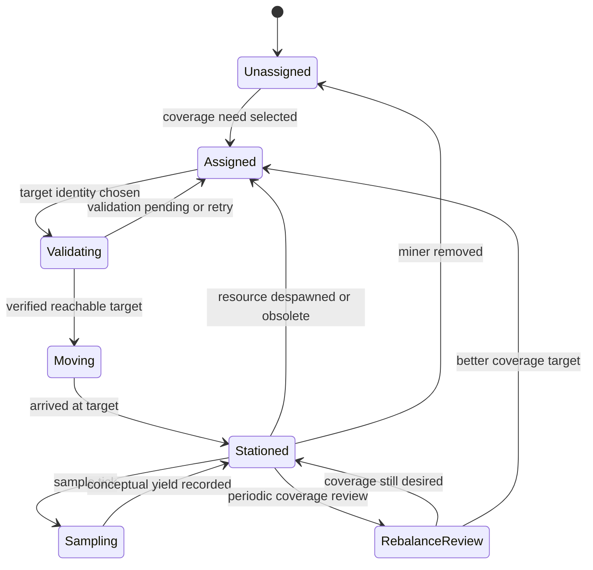
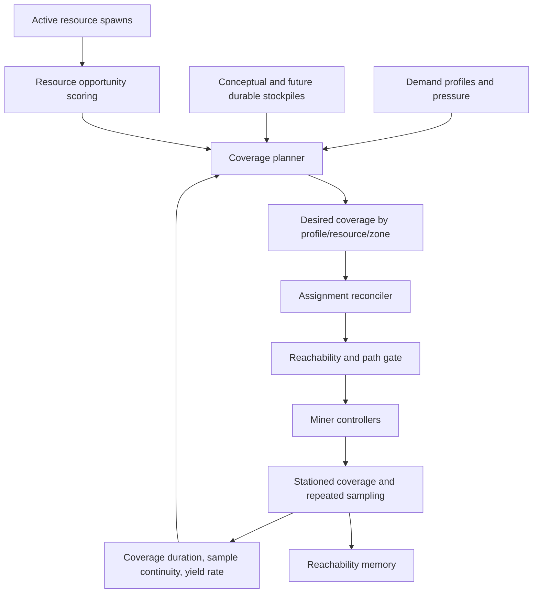

# P.3.0 End-State AI Miner Alignment and Coverage Model

This phase pauses feature work and aligns the existing AI economy pieces around the intended end-state behavior. It does not propose new economy mutations, real extraction, inventory changes, vendor changes, crafting changes, market changes, credit flows, or persistence writes.

The target is a small AI miner population that behaves as a coordinated coverage system. Individual miners are implementation details. The economy owns prioritization, coverage, assignment, and rebalance decisions.

## North Star

The primary optimization target is coverage stability.

The system should prefer:

- Stable profile/resource coverage.
- Long assignment duration once a useful target is reached.
- Repeated conceptual sampling while stationed.
- Rebalance only when demand, supply, resource quality, or resource lifecycle materially changes.

The system should not optimize for:

- More movement.
- More path attempts.
- More candidate generation.
- More assignment churn.
- More activation count.
- More target churn.

## End-State Lifecycle



Expected mature distribution:

| State | Expected role | Healthy share |
| --- | --- | --- |
| `stationed` / `covering` | Dominant steady state | 80-95% |
| `moving` | Relocation after rebalance or first assignment | 0-20% |
| `sampling` | Short recurring action inside stationed coverage | Bursty/transient |
| `unassigned` / idle | No valid coverage need or bootstrap gap | Very low |
| `candidate`, `validated`, `queued` | Planning and activation internals | Transient only |

## Coverage Architecture



Key architectural shift: the planner should eventually ask, "What coverage do we need and what coverage do we already have?" before asking, "Can this miner generate a new candidate?"

## Current System vs Intended System

| Area | Current behavior | Intended behavior |
| --- | --- | --- |
| Planner | Demand-weighted plans select per-miner targets and cap profiles with `maxMinersPerProfile`. | Coverage planner emits desired coverage counts per need and target. |
| Assignment identity | Assignments are keyed to miner target hashes and lifecycle state. | Assignments remain tied to coverage slots until a rebalance condition invalidates them. |
| Lifecycle | `candidate -> validated -> queued -> activation_started -> sample_started -> sample_complete`, then assignment commonly clears. | `assigned -> validating -> moving -> stationed/covering -> repeated sampling`, with assignment retained. |
| Movement | Activation success and path validation are highly visible metrics. | Movement is a means to reach coverage, not a success metric. |
| Sampling | Conceptual sample completion is recorded as an event/yield. | Repeated sample continuity while stationed is a core health metric. |
| Reachability memory | Mostly learns which candidates validate, reject, activate, or sample. | Learns which resource-location buckets produce sustained coverage. |
| Dashboard | Rich development telemetry for path, activation, reachability, candidate, and blocker diagnosis. | First viewport should summarize coverage stability, stationed share, uncovered needs, rebalance pressure, and assignment age. |
| Stockpile | Conceptual totals and optional persistent baseline are diagnostics. | Stockpile levels drive desired coverage and rebalance thresholds. |
| Safety | Strong conceptual-only boundaries are present. | Keep these boundaries until explicit economy mutation phases are approved. |

## Lifecycle State Audit

| State | Current meaning | Final-design role | Classification |
| --- | --- | --- | --- |
| `candidate` | Assignment exists but has not matched verified path validation. | Internal planning state only. | Temporary/transient |
| `validated` | Assignment has verified path snapshot and identity match. | Internal gate before first movement. | Temporary/transient |
| `queued` | Controller accepted a movement request but has not started it. | Internal controller queue. | Temporary/transient |
| `activation_started` | Miner is moving toward target. | Real relocation state, but not primary success. | Transient |
| `sample_started` | Miner is sampling at/near target. | Sampling tick inside stationed coverage. | Transient, should not replace coverage state |
| `sample_complete` | Intelligent sample completed. | Event, not a long-lived state. | Event/temporary |
| Proposed `stationed` | Miner arrived and remains assigned to a coverage slot. | Dominant steady state. | Permanent |
| Proposed `covering` | Miner is counted toward desired coverage for a need. | Coverage planner state; may include stationed or active sampling. | Permanent |
| Proposed `assigned_active` | Assignment is live and retained beyond activation. | Bridge state if `stationed` and `covering` are split. | Likely permanent or transitional |

Recommendation: add a long-lived assignment state such as `stationed` or `covering` before implementing more movement improvements. The current lifecycle can report short actions, but it lacks a state that says "this miner is successfully doing the final job."

## Dashboard Metric Classification

Permanent metrics should remain first-class in the end-state dashboard. Temporary metrics are useful during development and should move lower or into diagnostics. Misleading metrics are valid facts but can encourage the wrong behavior if promoted.

| Panel or metric | End-state success? | Risk | Classification | Alignment recommendation |
| --- | --- | --- | --- | --- |
| Active Miners | Yes, as population baseline. | None if paired with stationed/coverage count. | Permanent | Keep. |
| AI Population Idle | Partly. | Misleading until `stationed` exists; miners can be conceptually sampling but "idle" in assignment lane. | Misleading now | Redefine as no coverage assignment, not no active activation. |
| Assigned Miners | Yes. | Too broad without coverage target. | Permanent | Split into assigned, stationed, covering. |
| Travel Plans / Remote Priority | Future capability. | Can imply movement is desired. | Temporary | Keep diagnostic until actual travel exists. |
| Economy Health status | Yes. | Needs coverage-first status. | Permanent | Reframe recommendation around coverage stability. |
| Top Opportunities / Uncovered | Yes. | Good coverage signal if "uncovered" maps to desired coverage gaps. | Permanent | Promote. |
| Recent Yields | Partly. | Recent event volume can reward churn. | Temporary/permanent hybrid | Convert to yield continuity by stationed assignment. |
| Aware Quantity / Stockpile | Yes. | Good if tied to desired reserve thresholds. | Permanent | Keep and connect to coverage goals. |
| Path Failed / Blocked by Path | Development health. | Over-emphasizes pathfinding as goal. | Temporary | Move to diagnostics after stable coverage exists. |
| Intelligent Active | No, not final success. | Encourages activation count and movement. | Misleading if primary | Replace with Stationed/Covering Active. |
| Queued / Moving / Sampling bars | Sampling and moving are useful context. | Can encourage action churn. | Temporary | Move below coverage overview. Add Stationed bar. |
| Candidate count | No. | Candidate growth looks like progress but may be churn. | Temporary/misleading | Keep only in diagnostics. |
| Validation count | Gate health only. | Can over-reward validation throughput. | Temporary | Keep as path gate diagnostic. |
| Direct fallback count | No. | Useful for path debugging only. | Temporary | Keep in path diagnostics. |
| Movement readiness | Development gate health. | Too activation-centric for final dashboard. | Temporary | Keep until `stationed` exists. |
| Supply Session/Known | Yes. | Needs distinction between conceptual and future authoritative supply. | Permanent | Keep with safety labels. |
| AI Stockpile | Yes. | Good basis for coverage planning. | Permanent | Promote once coverage planner consumes it directly. |
| Resource-Aware Stockpile | Yes. | Strong bridge between resource identity and conceptual yield. | Permanent | Keep; add coverage source assignment id. |
| Demand profiles | Yes. | Currently pressure-oriented but useful. | Permanent | Add desired coverage, actual coverage, station duration. |
| Resource Scout opportunities | Yes. | Good opportunity input. | Permanent | Keep as source data, not outcome metric. |
| Resource Coverage | Yes. | Closest current panel to end-state success. | Permanent | Promote to first-class headline. |
| Coverage Alignment | Yes. | Strong audit of assignment-to-opportunity fit. | Permanent | Keep and extend with coverage slots. |
| Path Validation | Gate only. | Over-emphasizes path attempts and failures. | Temporary | Demote after stable stationed state is implemented. |
| Reachability Calibration | Development learning. | Candidate-centric. | Temporary | Reorient around sustained coverage outcomes. |
| Reachability Memory | Potentially permanent. | Currently candidate-centric. | Temporary until reweighted | Add station duration, sample ticks, resource lifecycle outcome. |
| NavArea Density | Development feature staging. | Can encourage new target generation. | Temporary | Keep diagnostic-only until proven to improve coverage duration. |
| Safety Boundaries | Yes. | Critical guardrail. | Permanent | Keep visible. |
| Live Assignments | Yes if redefined. | Current statuses are transient-heavy. | Permanent with changes | Show coverage state, target, age, rebalance reason. |
| Assignment History | Development and audit. | Useful for diagnosing churn. | Temporary/permanent hybrid | Add churn rate and clear reason totals. |

## Pathfinding Alignment

Pathfinding should be treated as a gate to coverage, not an objective.

Current dashboard and logs expose path validation outcomes, direct fallback counts, path failures, mismatch reasons, and reachability buckets. These are valuable while bootstrapping the system, but they should not sit above coverage outcomes in the mature dashboard.

Recommended pathfinding success metrics:

- Percent of desired coverage slots with verified reachable stationed miners.
- Median time from coverage need creation to stationed miner.
- Rebalance movement success rate.
- Stationed duration after verified path.
- Path failures per rebalance, not path failures per candidate.

Metrics to demote:

- Raw path attempts.
- Raw candidate count.
- Raw direct fallback count.
- Raw validation count without coverage context.

## Reachability Memory Alignment

Reachability memory should evolve from candidate success memory into coverage outcome memory.

Current learning events are useful:

- candidate generated
- candidate validated
- candidate rejected
- activated
- sample complete

End-state learning should weight these outcomes more strongly:

- station duration reached 5 minutes
- station duration reached 30 minutes
- repeated sample ticks while target remained valid
- resource despawned after sustained coverage
- reassignment happened because coverage was satisfied, not because path churned

Recommended confidence hierarchy:

| Signal | Proposed confidence value |
| --- | --- |
| Candidate generated | Weak |
| Verified path | Medium |
| Activation started | Medium |
| First sample complete | Strong |
| Stationed sampling for several intervals | Very strong |
| Coverage retained until planned rebalance/despawn | Strongest |

## Coverage Model Proposal

Introduce a first-class coverage slot model before adding more movement behavior.

Example desired coverage snapshot:

| Need | Desired miners | Actual covering | Gap | Rebalance priority |
| --- | ---: | ---: | ---: | --- |
| Chef Buff Foods | 2 | 1 | 1 | High |
| Production Infrastructure | 3 | 2 | 1 | Medium |
| Composite Armor Supply | 2 | 2 | 0 | Stable |

Coverage slot identity should include:

- demand profile key
- resource spawn identity
- resource type
- zone
- target location bucket
- desired miner count
- actual assigned miner ids
- coverage state
- station duration
- last sample time
- rebalance reason

## Recommended Next Phases

1. P.3.1 Coverage State Schema
   Define in-memory coverage slot structs and dashboard JSON fields. No behavior change. Add `desiredCoverage`, `actualCoverage`, `stationed`, `coverageGap`, `coverageAgeSeconds`, and `rebalanceReason`.

2. P.3.2 Stationed Lifecycle State
   Add a long-lived `stationed` or `covering` assignment status after arrival. Sampling should loop inside that state instead of clearing assignment after each intelligent sample.

3. P.3.3 Coverage-First Dashboard Header
   Promote coverage stability metrics above activation metrics: stationed miners, coverage gaps, average assignment age, churn rate, and uncovered high-priority needs.

4. P.3.4 Rebalance Policy
   Add explicit rebalance reasons and thresholds: resource despawn, quality obsolete, demand pressure material change, stockpile reserve satisfied, stronger opportunity, or manual/operator reset.

5. P.3.5 Reachability Memory Reweighting
   Shift memory confidence toward sustained stationed coverage and repeated sample completion. Candidate generation should become a weak signal.

6. P.3.6 Movement Throttling by Coverage Need
   Movement should happen only when coverage planner opens a slot or rebalance policy invalidates a current slot. Avoid replacing stable coverage for minor score changes.

7. P.3.7 Persistence Design Review
   Only after the coverage model is stable, decide what coverage and stockpile state should survive restart. Keep actual economy mutation out of scope until explicitly approved.

## Working Definition of Success

P.3 is successful when the dashboard can answer these questions directly:

- Which demand needs should be covered?
- How many miners should cover each need?
- How many miners are currently covering each need?
- Which miners are stationed and for how long?
- Which coverage gaps are worth moving for?
- Which existing assignments should not churn?
- Why did each rebalance happen?

Until those questions are first-class, additional pathfinding and activation work risks optimizing the wrong thing.

## P.3.1 / P.3.2 Implementation - Coverage Slots + Stationed Lifecycle

P.3.1/P.3.2 adds the first conservative implementation of coverage-oriented miner state. The new API/dashboard section is `coveragePlanner`. It is memory-only and derived from current demand profile settings, live intelligent assignments, and conceptual stockpile totals. It reports desired coverage slots, covered slots, total gap, stationed/moving/sampling/unassigned miners, coverage by profile, coverage by resource, uncovered needs, rebalance candidates, station duration summary, and station sample summary.

The long-lived assignment status is `stationed`. When `stationedMinerConfig.enableStationedLifecycle=true`, a successful intelligent conceptual sample can retain its existing assignment instead of clearing it as `sampleComplete`. The retained assignment keeps its generation id, target hash, activation snapshot id, target resource identity, demand profile, zone, station timestamp, last station sample timestamp, station sample count, conceptual station yield quantity, and station duration.

Repeated stationed sampling is separately gated by `stationedMinerConfig.enableStationedRepeatedSampling`. When enabled, it uses Core3 player sampling timing internally: sample results are modeled after the 3 second `sampleresults` task and the next stationed sample is scheduled after the 25 second player `sample` task interval. It does not create real resources, create `ResourceContainer` objects, mutate inventory, mutate vendors/market/crafting/credits, or write persistence.

Stationed assignments clear or become eligible for reassignment only through explicit reasons such as `resourceDespawned`, `demandNoLongerValid`, `reserveSatisfied`, `strongerOpportunity`, `minerInvalid`, `zoneMismatch`, `manualReset`, or `emergencyDisabled`. `sampleFinished` remains an event; it is no longer treated as assignment completion when stationed lifecycle is enabled and the assignment remains valid.

Configuration defaults:

```lua
stationedMinerConfig = {
    enableStationedLifecycle = true,
    enableStationedRepeatedSampling = true,
    stationedRequireDemandStillValid = true,
    stationedRequireResourceStillActive = true,
    stationedRequireSamePlanet = true,
    stationedClearWhenReserveSatisfied = true,
}
```

Existing activity diagnostics now distinguish movement activity from coverage activity. `minerActivity.coverageActiveCount` includes moving, sampling, and stationed assignments, and stationed miners are not counted as idle. The dashboard shows Coverage Planner rows before Coverage Alignment so stable coverage is visible above lower-level path and activation diagnostics.

Reachability memory is prepared for sustained coverage by recording `coverageRetainedCount`, `stationedSampleCount`, `stationedDurationSeconds`, and `sustainedCoverageConfidence` in runtime-only memory buckets. This strengthens positive evidence for locations that remain useful after arrival without changing candidate scoring, path validation trust, movement speed, NavArea behavior, extraction, inventory, market, vendor, crafting, credits, or persistence.

## P.3.3 Implementation - Coverage Definition Audit + Acquisition Readiness

P.3.3 tightens coverage terminology and adds acquisition-readiness diagnostics without implementing acquisition. The coverage planner now reports these definitions explicitly in `coveragePlanner.coverageDefinitions`:

- `desiredCoverage`: sum of desired miner coverage slots across enabled demand profiles.
- `assignedCoverage`: non-expired live assignments for a profile/resource/zone target.
- `stationedCoverage`: assignments whose lifecycle is `stationed` after arrival/sample.
- `activeCoverage`: stationed plus sampling plus queued/moving-to-target assignments.
- `fullyCoveredSlot`: profile slot whose active coverage is at least desired coverage.
- `partiallyCoveredSlot`: profile slot with some active coverage below desired coverage.
- `uncoveredSlot`: profile slot with no active coverage.
- `coverageGap`: `max(0, desiredCoverage - activeCoverage)`.
- `assignedButNotStationed`: live assignments that have not reached long-lived stationed coverage.

This means Desired, Covered, and Stationed can legitimately differ. Desired is the requested miner-slot total. Fully/partially/uncovered slot counts are profile-slot states. Stationed is only the productive retained state. Assigned miners can appear without active coverage when they are still candidate/validated, blocked, failed, or otherwise not yet queued/moving/sampling/stationed for that coverage slot.

Reserve display is also explicit. Coverage slots now expose:

- `exactResourceKnownQuantity`: runtime resource-aware conceptual yield tied to the exact source resource name.
- `resourceTypeKnownQuantity`: runtime resource-aware conceptual yield tied to the source resource type.
- `conceptualLabelKnownQuantity`: total known conceptual stockpile for the conceptual label.
- `demandMatchedKnownQuantity`: stockpile quantity matched to the demand profile.
- `stockpileKnownQuantity`: the display quantity chosen from the strongest available confidence tier.
- `stockpileConfidence`: `exact_resource`, `resource_type`, `conceptual_label`, `demand_profile`, or `none`.

`acquisitionReadiness` is a diagnostics-only API/dashboard section. A stationed miner is marked ready only when it is stationed, has known resource identity, is on the same planet, has a still-valid demand profile, is below reserve target when that gate is enabled, has verified activation-path provenance, and all safety flags are clean while real acquisition remains disabled.

Example payload shape:

```json
{
  "mode": "diagnostics-only",
  "realResourceAcquisitionEnabled": false,
  "stationedMiners": 6,
  "acquisitionReadyMiners": 4,
  "acquisitionBlockedMiners": 2,
  "acquisitionBlockedReasons": [
    { "reason": "reserveSatisfied", "count": 1 },
    { "reason": "activationPathNotVerified", "count": 1 }
  ],
  "readyRows": [
    {
      "minerId": 12345,
      "assignmentGenerationId": 77,
      "resourceName": "example_resource",
      "resourceType": "iron",
      "conceptualLabel": "iron",
      "planet": "naboo",
      "demandProfile": "production_infrastructure",
      "stationDurationSeconds": 900,
      "stationSampleCount": 3,
      "activationPathTrustStatus": "verifiedPath",
      "stockpileConfidence": "resource_type",
      "reserveRatio": 0.42,
      "acquisitionReadinessStatus": "ready",
      "acquisitionReadinessReason": "ready"
    }
  ]
}
```

`realResourceAcquisitionConfig` contains placeholders only:

```lua
realResourceAcquisitionConfig = {
    enableRealResourceAcquisition = false,
    acquisitionReadinessDiagnosticsEnabled = true,
    requireStationedLifecycle = true,
    requireVerifiedActivationPath = true,
    requireKnownResourceSpawnIdentity = true,
    requireDemandStillValid = true,
    requireReserveBelowTarget = true,
    maxAcquisitionsPerInterval = 0,
}
```

This phase still does not create resources, call extraction APIs, create `ResourceContainer` objects, mutate inventory, mutate vendors/market/crafting/credits, change demand/resource scoring, change path trust rules, change movement speed, change NavArea behavior, or write persistence.

Market observation remains diagnostic and now defaults to listing-metadata-only resolution. `marketSupplyObservationConfig.resolveResourceContainers=false` prevents the observer from calling `ZoneServer::getObject` for auctioned items during normal dashboard/API operation, and `startupDelaySeconds` delays that heavier opt-in path after manager startup. This keeps acquisition-readiness and coverage diagnostics from forcing persistent object loads while the object broker is doing startup backup/update work.

## P.3.4 - Simulated Acquisition Transactions

P.3.4 adds `simulatedAcquisition`, a runtime-only ledger for exact resource acquisition events. A miner that completes an intelligent sample and passes the acquisition-readiness gates records the same exact assignment resource a future real miner would acquire:

- `resourceName`: spawned SWG resource name, such as `Ptohi`, `Miki`, or `Nasi`.
- `resourceType` / `resourceClass`: spawned SWG resource type, such as `fruit_fruits_naboo` or `steel_duralloy`.
- `planet`, `spawnIdentity`, `density`, `concentration`, `demandProfile`, assignment generation, activation snapshot, path trust status, station duration, and quantity.

The conceptual label is retained only as reporting provenance. It is not used as the acquired resource identity, and the dashboard transaction table displays actual resource name/type rather than labels like Iron, Copper, Gas, or Water.

Example payload shape:

```json
{
  "mode": "runtime-ledger",
  "simulationOnly": true,
  "readyMiners": 4,
  "acquisitions": 12,
  "resourcesAcquired": 286,
  "uniqueResources": 5,
  "averageQuantity": 23.83,
  "acquisitionAttempts": 14,
  "successfulAcquisitions": 12,
  "blockedAcquisitions": 2,
  "events": [
    {
      "minerId": 12345,
      "resourceName": "Ptohi",
      "resourceType": "fruit_fruits_naboo",
      "planet": "naboo",
      "quantity": 18,
      "density": 61.5,
      "demandProfile": "production_food",
      "activationPathTrustStatus": "verifiedPath"
    }
  ]
}
```

Config:

```lua
realResourceAcquisitionConfig = {
    enableRealResourceAcquisition = false,
    acquisitionReadinessDiagnosticsEnabled = true,
    enableSimulatedAcquisitionTransactions = true,
    simulatedAcquisitionLogTransactions = true,
    simulatedAcquisitionMaxLedgerEvents = 200,
    requireStationedLifecycle = true,
    requireVerifiedActivationPath = true,
    requireKnownResourceSpawnIdentity = true,
    requireDemandStillValid = true,
    requireReserveBelowTarget = true,
    maxAcquisitionsPerInterval = 0,
}
```

The transaction is recorded before the existing conceptual/resource-aware stockpile update, so a sample that satisfies the reserve still appears in the ledger. Reserve math remains otherwise unchanged. This phase still does not call extraction APIs, create `ResourceContainer` objects, mutate inventory, mutate vendors/market/crafting/credits, change demand/resource scoring, change coverage planning, change path validation, change movement/NavArea behavior, or write persistence.

### P.3.4.1 - Counter vs Ledger Retention Audit

`simulatedAcquisitionMaxLedgerEvents` is retention only. It caps the recent transaction rows kept in memory, not the lifetime/runtime counters. The dashboard separates:

- `acquisitions`: total successful simulated acquisitions this server runtime.
- `resourcesAcquired`: total simulated quantity this server runtime.
- `ledgerRetainedRows`: recent rows currently retained for table display.
- `ledgerMaxRows`: configured recent-row retention cap.

`maxAcquisitionsPerInterval` remains a placeholder for future real acquisition and does not block simulated ledger transactions. If simulated acquisition stops ticking while miners remain ready, check whether additional sample-finished events are being scheduled. With `stationedMinerConfig.enableStationedRepeatedSampling=false`, a stationed miner records its initial successful sample/acquisition and then remains productive coverage without generating more transactions; the P.3.4.2 runtime config enables repeated stationed sampling.

### P.3.4.3 - Single Owner Miner Work Loop

The intended miner loop is now the exact-resource stationed lifecycle: coverage slot, exact resource assignment, verified path, move to resource, stationed, repeated exact-resource sampling, simulated acquisition transaction, then remain stationed until coverage or rebalance logic clears/reassigns the assignment.

When `minerIntelligentTargetingConfig.enabled=true` and `stationedMinerConfig.enableStationedLifecycle=true`, the legacy conceptual miner loop is suppressed by default. `startSimLoop()` activates a pending intelligent assignment, leaves stationed miners under stationed-sample ownership, or waits for a planner assignment. It does not randomly choose broad labels such as Iron, Copper, Gas, or Water unless explicit legacy fallback config is enabled.

The controller has a memory-only `workLoopGeneration` guard for delayed path, arrival, retry, survey-finish, sample-finish, and stationed-sample callbacks. If a delayed callback belongs to an older lifecycle generation, it exits without manager or logger side effects and without moving or sampling the miner. This prevents stale retries or legacy behavior tasks from pulling a stationed miner away from the exact resource target.

Default config keeps legacy fallback off:

```lua
minerIntelligentTargetingConfig = {
    fallbackToConceptualLoop = false,
}

legacyMinerLoopConfig = {
    enableLegacyConceptualLoop = false,
    allowLegacyFallbackWhenNoIntelligentAssignment = false,
    allowLegacyFallbackAfterIntelligentFailure = false,
    logLegacySuppression = true,
}
```

Temporary legacy testing should use the explicit `legacyMinerLoopConfig` flags. Runtime proof fields are `minerActivity.legacyLoopSuppressedCount`, `legacyLoopStartedCount`, `intelligentLoopStartedCount`, and `lastSuppressedLegacyReason`. Safety boundaries remain unchanged: no real acquisition, no `ResourceContainer` creation, no inventory/vendor/market/crafting/credit mutation, no path-trust changes, no demand/resource scoring changes, no movement-speed changes, no NavArea changes, and no persistence writes.

### P.3.4.2 - Stationed Sampling Loop With Game-Derived Timing

Normal player sampling is implemented through `ResourceSpawner::sendSample`, `SurveySessionImplementation::rescheduleSampleResults`, and `SurveySessionImplementation::rescheduleSample`. The player path validates the active survey session/tool/resource/zone, computes density at the player position, schedules sample results after 3000 ms, and schedules the next sample task after 25000 ms. `ResourceSpawner::sendSampleResults` then uses surveying skill, density, private samplerate/samplesize modifiers, gamble/rich-node modifiers, and finally calls `extractResource` and inventory/container mutation only after the successful sample quantity is known.

AI stationed sampling copies only the simulation-safe timing and quantity shape. It uses an internal Master Artisan surveying constant of 100, the density-based quantity formula shape `density * (25 + random(3))`, no gamble/rich-node/city multiplier, a 3 second sample result delay, and a 25 second stationed sample interval. The exact spawned resource remains the acquisition identity: `resourceName`, `resourceType`, `planet`, assignment generation, activation snapshot, target hash, density, and path trust provenance. Broad labels such as Iron, Copper, Gas, and Water are not acquisition identities.

The Lua config no longer exposes interval, jitter, max-sample, or max-duration knobs for stationed sampling. The high-level switches are `enableStationedLifecycle` and `enableStationedRepeatedSampling`, plus the existing safety toggles for demand validity, active resource identity, same planet, and reserve satisfaction. Once repeated sampling is enabled, a stationed miner keeps sampling until coverage or safety logic clears/reassigns it.

The API/dashboard fields `stationedSamplingEnabled`, `sampleIntervalSource`, `sampleIntervalSeconds`, `stationedSampleTicks`, `simulatedAcquisitionTransactions`, `exactResourceTotals`, and `lastStationedSampleAgeSeconds` make the loop observable. Runtime totals continue independently of recent ledger row retention.

### P.3.4.4 - Miner Self-Healing, Safe Nudge, and Debug Teleport Tools

P.3.4.4 introduces a recovery monitor for intelligent miner assignments. It is focused on liveness and assignment health, not increased movement. The monitor records current vs target position, current vs target zone, distance to station target, assignment age, movement age, last sample age, last simulated acquisition age, expected next stationed sample, lifecycle status, stuck reason, recovery recommendation, and copyable current/target coordinates.

The API/dashboard section is `minerRecovery`. It exposes tracked/healthy/attention counts, action counters, dry-run state, recovery config flags, status/reason counts, and per-miner rows with controller/miner presence, combat/dead/incap flags, distance, ages, recommendation, and last action.

Default config keeps diagnostics active and recovery non-mutating:

```lua
minerRecoveryConfig = {
    enabled = true,
    dryRun = true,
    allowClearAssignment = true,
    allowNudgeToSafeNearbyPoint = false,
    allowTeleportToStationTarget = false,
    allowRespawnReplacement = false,
    adminActionsEnabled = false,
    stuckCheckIntervalSeconds = 60,
    movingStuckSeconds = 180,
    stationedSamplingGraceSeconds = 90,
    farFromStationDistanceMeters = 32,
    maxAutomaticRecoveriesPerInterval = 2,
    maxRecoveriesPerMinerPerHour = 3,
    logRecoveryDecisions = true,
}
```

When `dryRun=false`, automatic recovery remains deliberately narrow: it can clear a stuck assignment through the existing assignment-clear path when rate limits allow. Nudge, teleport, and respawn are represented as disabled debug capabilities in this phase; copyable coordinates are preferred until a safe explicit admin action path is implemented and enabled. No player or non-SimPlayer teleport is added.

Safety boundaries remain unchanged: no real acquisition, no `ResourceContainer` creation, no inventory/vendor/market/crafting/credit mutation, no path trust relaxation, no movement speed change, no global NavArea behavior change, and no persistence writes.
